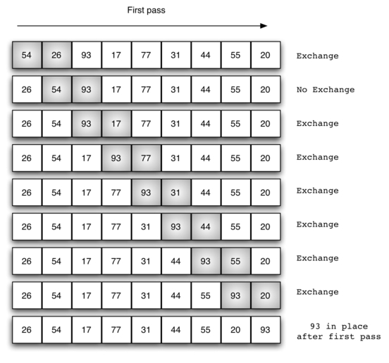
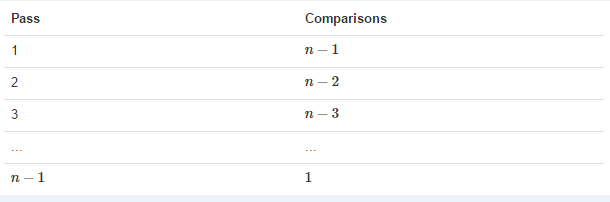
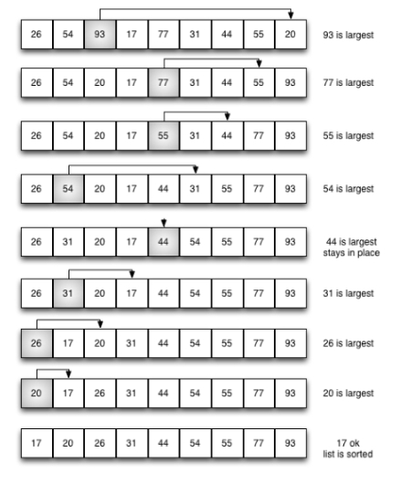
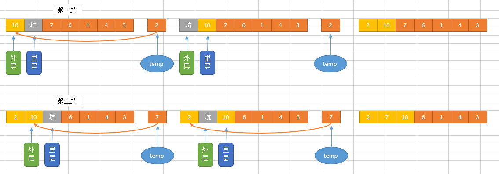
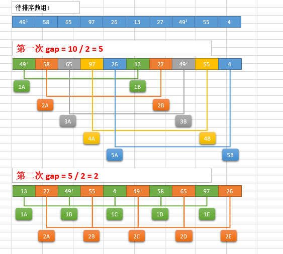
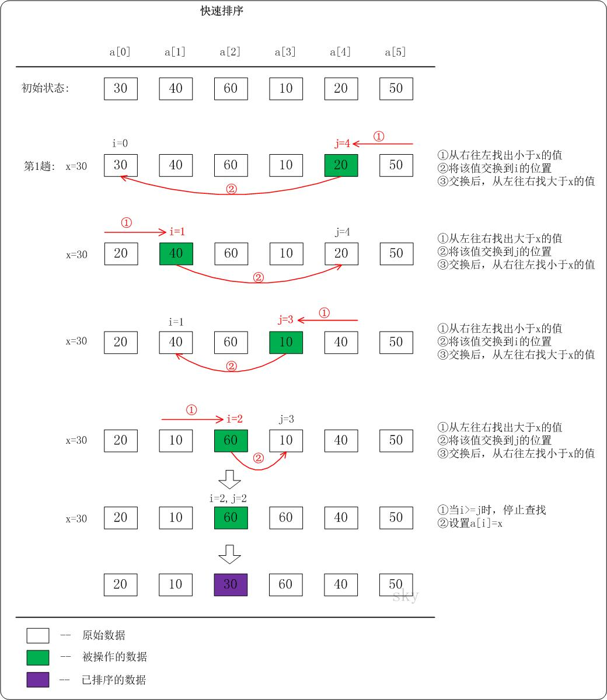

来自：bilibili —— [数据结构与算法（Python版）](https://www.bilibili.com/video/BV17J411i7zS)

它是一种能将一串数据依照特定顺序进行排列的算法。

排序算法的稳定性？

**稳定性**：稳定排序算法会让原本有相等键值的纪录维持相对次序。也就是如果一个排序算法是稳定的，当有两个相等键值的纪录R和S，且在原本的列表中R出现在S之前，在排序过的列表中R也将会是在S之前。

当相等的元素是无法分辨的，比如像是整数，稳定性并不是一个问题。然而，假设以下的数对将要以他们的第一个数字来排序。

```
(4, 1)  (3, 1)  (3, 7)（5, 6）
```

在这个状况下，有可能产生两种不同的结果，一个是让相等键值的纪录维持相对的次序，而另外一个则没有：

```
(3, 1)  (3, 7)  (4, 1)  (5, 6)  （维持次序）
(3, 7)  (3, 1)  (4, 1)  (5, 6)  （次序被改变）
```

不稳定排序算法可能会在相等的键值中改变纪录的相对次序，但是稳定排序算法从来不会如此。不稳定排序算法可以被特别地实现为稳定。作这件事情的一个方式是人工扩充键值的比较，如此在其他方面相同键值的两个对象间之比较，（比如上面的比较中加入第二个标准：第二个键值的大小）就会被决定使用在原先数据次序中的条目，当作一个同分决赛。然而，要记住这种次序通常牵涉到额外的空间负担。

#### 冒泡排序

**冒泡排序**（英语：Bubble Sort）是一种简单的排序算法。它重复地遍历要排序的数列，一次比较两个元素，如果他们的顺序错误就把他们交换过来。遍历数列的工作是重复地进行直到没有再需要交换，也就是说该数列已经排序完成。这个算法的名字由来是因为越小的元素会经由交换慢慢“浮”到数列的顶端。

冒泡排序算法的运作如下：

- 比较相邻的元素。如果第一个比第二个大（升序），就交换他们两个。
- 对每一对相邻元素作同样的工作，从开始第一对到结尾的最后一对。这步做完后，最后的元素会是最大的数。
- 针对所有的元素重复以上的步骤，除了最后一个。
- 持续每次对越来越少的元素重复上面的步骤，直到没有任何一对数字需要比较。

##### 冒泡排序的分析

交换过程图示（第一次）：



那么我们需要进行n-1次冒泡过程，每次对应的比较次数如下图所示：



##### 时间复杂度
- 最优时间复杂度：O（n），表示遍历一次发现没有任何可以交换的元素，排序结束。
- 最坏时间复杂度：O（n**2），
- 稳定性：稳定？

##### 冒泡排序的演示

www.runoob.com效果：


#### 选择排序

选择排序（Selection sort）是一种简单直观的排序算法。它的工作原理如下。首先在未排序序列中找到最小（大）元素，存放到排序序列的起始位置，然后，再从剩余未排序元素中继续寻找最小（大）元素，然后放到已排序序列的末尾。以此类推，直到所有元素均排序完毕。

选择排序的主要优点与数据移动有关。如果某个元素位于正确的最终位置上，则它不会被移动。选择排序每次交换一对元素，它们当中至少有一个将被移到其最终位置上，因此对n个元素的表进行排序总共进行至多n-1次交换。在所有的完全依靠交换去移动元素的排序方法中，选择排序属于非常好的一种。

##### 选择排序分析

排序过程




红色表示当前最小值，黄色表示已排序序列，蓝色表示当前位置。

##### 时间复杂度

- 最优时间复杂度：O（n**2）
- 最坏时间复杂度：O（n**2）
- 稳定性：不稳定（考虑升序每次选择最大的情况）？

##### 选择排序的演示


#### 插入排序
是一种简单直观的排序算法，其原理是通过构建有序序列，对于未排序数据，在已排序序列中
从后往前扫描，找到相应位置并插入。  

插入排序在实现上，在从后往前扫描过程中，需要反复把已排序元素逐步向后挪位，为最新
元素提供插入空间。

##### 插入排序的分析



##### 时间复杂度
- 最优时间复杂度：O(n) （升序排列，序列已经处于升序状态）
- 最坏时间复杂度：O(n**2)
- 稳定性：稳定

##### 插入排序演示


#### 希尔排序

希尔排序(Shell Sort)是插入排序的一种。也称缩小增量排序，是直接插入排序算法的一种更高效的改进版本。
希尔排序是非稳定排序算法。该方法因DL．Shell于1959年提出而得名。 
希尔排序是把记录按下标的一定增量分组，对每组使用直接插入排序算法排序；
随着增量逐渐减少，每组包含的关键词越来越多，当增量减至1时，整个文件恰被分成一组，算法便终止。

#####希尔排序过程
希尔排序的基本思想是：将数组列在一个表中并对列分别进行插入排序，重复这过程，
不过每次用更长的列（步长更长了，列数更少了）来进行。最后整个表就只有一列了。
将数组转换至表是为了更好地理解这算法，算法本身还是使用数组进行排序。

例如，假设有这样一组数[ 13 14 94 33 82 25 59 94 65 23 45 27 73 25 39 10 ]，
如果我们以步长为5开始进行排序，我们可以通过将这列表放在有5列的表中来更好地描述算法，
这样他们就应该看起来是这样(竖着的元素是步长组成)：
```
13 14 94 33 82
25 59 94 65 23
45 27 73 25 39
10
```
然后我们对每列进行排序：
```
10 14 73 25 23
13 27 94 33 39
25 59 94 65 82
45
```
将上述四行数字，依序接在一起时我们得到：[ 10 14 73 25 23 13 27 94 33 39 25 59 94 65 82 45 ]。这时10已经移至正确位置了，然后再以3为步长进行排序：
```
10 14 73
25 23 13
27 94 33
39 25 59
94 65 82
45
```
排序之后变为：
```
10 14 13
25 23 33
27 25 59
39 65 73
45 94 82
94
```
最后以1步长进行排序（此时就是简单的插入排序了）

##### 希尔排序的分析



##### 时间复杂度
- 最优时间复杂度：根据步长序列的不同而不同
- 最坏时间复杂度：O(n2)
- 稳定想：不稳定

##### 希尔排序演示


#### 快速排序

快速排序（英语：Quicksort），又称划分交换排序（partition-exchange sort），通过一趟排序将要排序的数据分割成独立的两部分，其中一部分的所有数据都比另外一部分的所有数据都要小，然后再按此方法对这两部分数据分别进行快速排序，整个排序过程可以递归进行，以此达到整个数据变成有序序列。

步骤为：

1. 从数列中挑出一个元素，称为"基准"（pivot），
2. 重新排序数列，所有元素比基准值小的摆放在基准前面，所有元素比基准值大的摆在基准的后面（相同的数可以到任一边）。在这个分区结束之后，该基准就处于数列的中间位置。这个称为分区（partition）操作。
3. 递归地（recursive）把小于基准值元素的子数列和大于基准值元素的子数列排序。

递归的最底部情形，是数列的大小是零或一，也就是永远都已经被排序好了。虽然一直递归下去，但是这个算法总会结束，因为在每次的迭代（iteration）中，它至少会把一个元素摆到它最后的位置去。

##### 快速排序的分析



```code

```

##### 时间复杂度

- 最优时间复杂度：O(nlogn)
- 最坏时间复杂度：O(n2)
- 稳定性：不稳定

从一开始快速排序平均需要花费O(n log n)时间的描述并不明显。但是不难观察到的是分区运算，数组的元素都会在每次循环中走访过一次，使用O(n)的时间。在使用结合（concatenation）的版本中，这项运算也是O(n)。

在最好的情况，每次我们运行一次分区，我们会把一个数列分为两个几近相等的片段。这个意思就是每次递归调用处理一半大小的数列。因此，在到达大小为一的数列前，我们只要作log n次嵌套的调用。这个意思就是调用树的深度是O(log n)。但是在同一层次结构的两个程序调用中，不会处理到原来数列的相同部分；因此，程序调用的每一层次结构总共全部仅需要O(n)的时间（每个调用有某些共同的额外耗费，但是因为在每一层次结构仅仅只有O(n)个调用，这些被归纳在O(n)系数中）。结果是这个算法仅需使用O(n log n)时间。

##### 快速排序演示

