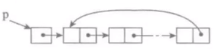

One way circular list

单向循环链表

单链表的一个简单的变形就是单向循环链表，链表中最后一个节点的next域不再为None，而是指向链表的头节点。

**操作：**

- is_empty()  # 判断链表是否为空
- length()  # 返回链表的长度
- travel()  # 遍历
- add(item)  # 在头部添加一个节点
- append(item)  # 在尾部添加一个节点
- insert(pos, item)  # 在指定位置pos添加节点
- remove(item)  # 删除一个节点
- search(item)  # 查找节点是否存在

**实现**

...

